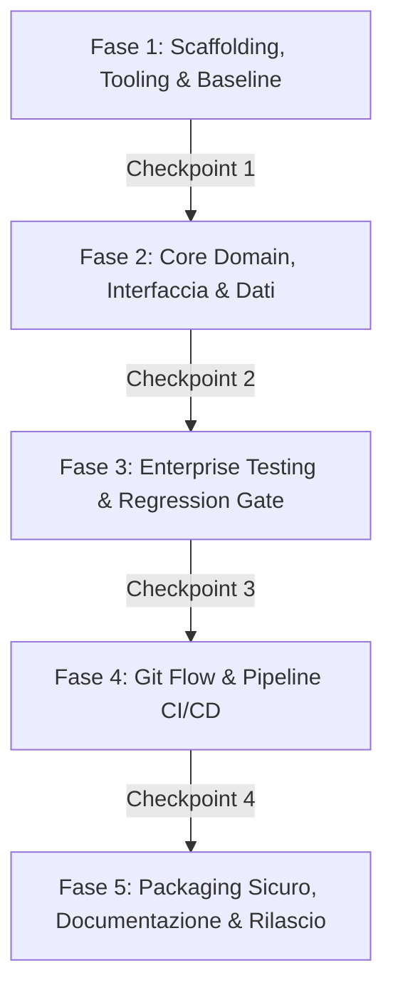

# 🚀 Enterprise Project Kickoff Workflow

Questo workflow guida l'agente AI e lo sviluppatore attraverso **5 fasi sequenziali e rigorose**, replicando lo standard di eccellenza ingegneristica (scaffolding moderno, clean architecture, test parametrizzati e di regressione, CI/CD con gate di copertura, containerizzazione sicura e documentazione viva).

---

## ⚙️ Parametri del Progetto (Placeholder di Configurazione)

Prima di avviare il workflow, compila o richiedi all'utente la compilazione dei seguenti parametri:

```yaml
# ==============================================================================
# CONFIGURAZIONE INIZIALE PROGETTO
# ==============================================================================
PROJECT_NAME: "{{PROJECT_NAME}}"                       # Es: order-management, analytics-hub, backup-cli
PROJECT_ARCHETYPE: "{{PROJECT_ARCHETYPE}}"             # [Backend API | Full-Stack App | CLI Tool | Library/SDK]
PRIMARY_LANGUAGE: "{{PRIMARY_LANGUAGE}}"               # Es: Python 3.12, TypeScript (Node 22 / Bun), Go 1.23, Rust
PACKAGE_MANAGER: "{{PACKAGE_MANAGER}}"                 # Es: uv, pnpm, cargo, go modules
CORE_FRAMEWORKS: "{{CORE_FRAMEWORKS}}"                 # Es: FastAPI + SQLAlchemy 2.0, Next.js + Tailwind, Typer, Axum
DATABASE_OR_STORAGE: "{{DATABASE_OR_STORAGE}}"         # Es: SQLite / PostgreSQL / Redis / In-Memory / None
TEST_RUNNER: "{{TEST_RUNNER}}"                         # Es: pytest, vitest, cargo test, go test
COVERAGE_GATE_PERCENT: "{{COVERAGE_GATE_PERCENT}}"     # Default: 80%
CONTAINER_RUNTIME: "{{CONTAINER_RUNTIME}}"             # [Docker multi-stage | None]
REPO_VISIBILITY: "{{REPO_VISIBILITY}}"                 # [public | private]

DOMAIN_REQUIREMENTS: |
  {{Inserisci qui la descrizione dettagliata del dominio di business,
    i requisiti funzionali, le entità cardine e i casi d'uso principali}}
```

---

## 🛑 Regole Inviolabili di Esecuzione ("Human-in-the-Loop")

1. **Gate Sequenziali Obbligatori**: L'agente AI **NON DEVE MAI** eseguire più fasi in una sola interazione. A ogni fase corrisponde un blocco di implementazione seguito dal relativo **Checkpoint di Verifica**.
2. **Attesa di Approvazione Esplicita**: Al termine di ogni fase, l'agente deve verificare la correttezza del codice, mostrare l'esito dei comandi eseguiti e **fermarsi tassativamente**, attendendo la conferma dell'utente prima di passare alla fase successiva.
3. **Zero Regressioni**: Nessuna nuova feature può essere considerata conclusa se la suite di test esistente non rimane al 100% verde.
4. **Convenzione dei Commit**: Tutti i commit Git devono seguire rigorosamente la specifica *Conventional Commits* (`feat:`, `fix:`, `test:`, `docs:`, `chore:`).
5. **Clean Architecture & Strict Typing**: Separazione netta tra modelli di dominio, schemi DTO di validazione e layer di presentazione. Zero tolleranza per parametri non tipizzati.

---

## 📋 Il Flusso di Lavoro a 5 Fasi



---

### 🔹 Fase 1: Scaffolding, Tooling & Architettura Modulare

#### Obiettivi
1. Inizializzare il progetto utilizzando il package manager specificato (`{{PACKAGE_MANAGER}}`) con lockfile deterministico.
2. Predisporre la struttura delle cartelle in base a `{{PROJECT_ARCHETYPE}}`:
   * **Backend API / CLI / Library**: cartella sorgente `src/{{PROJECT_NAME}}/`, modulo per la configurazione d'ambiente (`config.py` o `.env`), e cartella `tests/`.
   * **Full-Stack App**: struttura modulare (es. monorepo con `apps/api` e `apps/web`, oppure `client/` e `server/` chiaramente separati).
3. Configurare gli strumenti di qualità del codice:
   * **Linter & Formatter**: (es. Ruff per Python, Biome/ESLint per TypeScript, golangci-lint, clippy per Rust).
   * **Static Type Checker**: (es. Mypy con strict mode, `tsc --noEmit`).
4. Creare `.gitignore`, file di ambiente di esempio (`.env.example`) e documentazione di setup iniziale.

#### 🛑 Checkpoint Fase 1
* Eseguire il comando di installazione delle dipendenze.
* Eseguire il linter e il formatter verificando che non ci siano errori su file vuoti o template.
* Chiedere all'utente: *"Fase 1 completata con successo. Posso procedere con la Fase 2 (Core Domain & Interfaccia)?"*

---

### 🔹 Fase 2: Core Domain, Interfaccia & Persistenza

#### Obiettivi
1. **Modelli di Dominio**:
   * Definire le entità principali del dominio con tipi stretti e vincoli di integrità.
   * Se previsto database (`{{DATABASE_OR_STORAGE}}`): configurare l'ORM/Driver con relazioni, foreign key, e vincoli a cascata.
2. **Schemi DTO di Validazione**:
   * Creare schemi di input e output rigorosi (es. Pydantic V2, Zod, structs tipizzate) con validatori personalizzati per campi sensibili (email, password, range numerici).
3. **Autenticazione & Sicurezza**:
   * Se applicabile, implementare hashing sicuro delle password (es. Argon2id / bcrypt).
   * Gestire autenticazione stateless (token JWT Bearer) o chiavi API con middleware dedicato.
4. **Controller / Interfaccia**:
   * *Backend*: Definire rotte REST/gRPC modulari con router dedicati e handler globale delle eccezioni di dominio.
   * *Full-Stack*: Aggiungere layout, design tokens e componenti UI reattivi consumando i contratti tipizzati.
   * *CLI*: Costruire l'albero di comandi con help dettagliato, flag e validazione argomenti.

#### 🛑 Checkpoint Fase 2
* Avviare uno smoke test rapido del servizio / comando.
* Eseguire il type check statico per verificare che l'intero layer sia privo di errori di tipo.
* Chiedere all'utente: *"Fase 2 completata con successo. Posso procedere con la Fase 3 (Testing & Regression Suite)?"*

---

### 🔹 Fase 3: Enterprise Test Suite, Parametrizzazione & Regression Gate

#### Obiettivi
1. **Ambiente di Test Isolato & Veloce**:
   * Configurare il test runner (`{{TEST_RUNNER}}`) per eseguire test in-memory o con mock veloci (esecuzione totale della suite < 3 secondi).
2. **Unit & Integration Tests**:
   * Testare i flussi positivi (*Happy Path*) e i flussi di errore (*Sad Path*: 400, 401, 403, 404, 422).
3. **Test Parametrizzati**:
   * Utilizzare parametri per verificare matrici di dati di confine (stringhe vuote, caratteri speciali, valori nulli, overflow).
4. **Suite di Regressione Dedicata**:
   * Creare un marker/tag esplicito (es. `@pytest.mark.regression`) per proteggere in modo permanente l'applicazione dai bug critici risolti.
5. **Coverage Gate**:
   * Configurare il report di code coverage con fallimento automatico se la percentuale scende al di sotto di `{{COVERAGE_GATE_PERCENT}}`.

#### 🛑 Checkpoint Fase 3
* Lanciare la suite di test completa e mostrare il report di copertura.
* Lanciare selettivamente solo i test di regressione.
* Chiedere all'utente: *"Tutti i test sono verdi e la copertura è al [X]%. Posso procedere con la Fase 4 (Git Flow & CI/CD)?"*

---

### 🔹 Fase 4: Git Flow, Conventional Commits & Pipeline CI/CD

#### Obiettivi
1. **Controllo di Versione Git**:
   * Inizializzare il repository locale sul ramo `main` ed effettuare commit semantici.
2. **Pipeline CI Cloud (`.github/workflows/ci.yml`)**:
   * Configurare un workflow GitHub Actions in ambiente pulito (es. `ubuntu-latest`).
   * Attivare il caching delle dipendenze vincolato al lockfile del package manager.
   * Definire tutti i gate obbligatori:
     * Check linter
     * Check formatter
     * Type checking statico
     * Esecuzione test con soglia di coverage
     * Esecuzione dedicata della suite di regressione
3. **Standardizzazione Pull Request**:
   * Creare `.github/pull_request_template.md` con checklist di autocontrollo.
4. **Simulazione Git Flow**:
   * Creare un branch tematico `feature/...`, sviluppare una feature minore con relativo test, effettuare il merge con `--no-ff` e verificare l'albero con `git log --graph`.

#### 🛑 Checkpoint Fase 4
* Verificare la validità della sintassi del workflow YAML.
* Mostrare l'albero dei commit Git.
* Chiedere all'utente: *"Fase 4 completata. Posso procedere con la Fase 5 (Containerizzazione, Documentazione & Rilascio)?"*

---

### 🔹 Fase 5: Packaging Sicuro, Documentazione Viva & Rilascio v1.0.0

#### Obiettivi
1. **Packaging di Produzione**:
   * Se servizio web: creare `Dockerfile` multi-stage ottimizzato (stage di compilazione + runner minimale con utente unprivileged non-root e `HEALTHCHECK` nativo) e file `.dockerignore`.
   * Se CLI/Library: configurare gli script di packaging binario o pubblicazione nel registry.
2. **Documentazione Viva e Trasparente**:
   * `README.md`: Titolo, badge di stato, diagramma architetturale, tabella esaustiva delle API/comandi ed esempi curl/CLI.
   * `DESIGN.md`: Architecture Decision Records (ADR), rationale delle scelte tecnologiche e analisi dei trade-off.
   * `JOURNAL.md`: Diario cronologico delle sessioni, tracciamento dei bug incontrati e competenze apprese.
3. **Release & Tagging**:
   * Creare il tag Git semantico `v1.0.0`.
   * Pubblicare la formal Release su GitHub (tramite GitHub MCP o API) con note di rilascio dettagliate.

#### 🛑 Checkpoint Finale
* Eseguire uno smoke test sul container o pacchetto generato.
* Presentare all'utente il riepilogo finale del progetto con i link a tutti i documenti creati.
